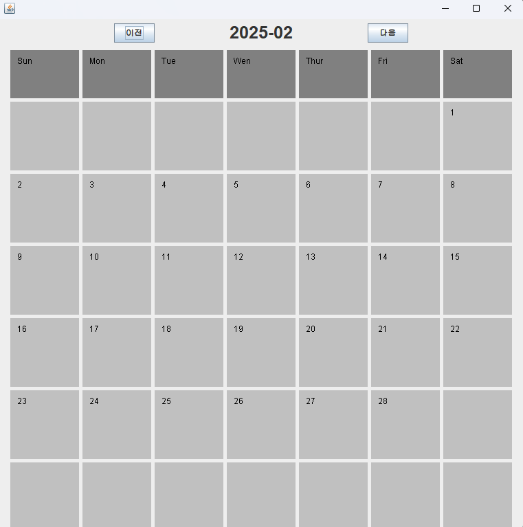

# java GUI swing으로 calendar 구현

## 핵심
- DateBox.java → 날짜 박스를 생성하는 클래스
- Diary.java → 메인 달력 창 (월 이동, 날짜 표시)
- StringManager.java → 한 자리 숫자를 두 자리로 변환하는 유틸리티 클래스

### [1] DateBox.java (날짜 박스 UI 컴포넌트)
- 달력에서 날짜를 표시하는 "박스" 역할
- 배경색 설정 (Color color)
- 날짜 텍스트를 그리는 paint(Graphics g) 메서드 구현

### [2] Diary.java (달력 UI & 기능)
- 메인 달력을 위한 기능

### [3] StringManager.java (유틸리티 클래스)
- 숫자를 "01", "02", ..., "09", "10" 형식으로 변환
- setDateTitle()에서 사용됨 → YYYY-MM 형식 유지

## 실행 흐름
1. Diary 실행 → 달력 UI 창이 나타남
2. "이전" / "다음" 버튼을 클릭하면 월이 변경됨
3. DateBox가 날짜를 표시하고 UI 업데이트됨