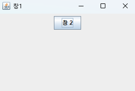
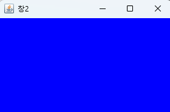

# JAVA swing으로 버튼 눌러 창 전환 하기

## 핵심 설명
JFrame을 이용해 창을 띄우고 버튼 클릭 시 창을 전환하는 GUI 프로그램
- FirstPage.java → 첫 번째 창 (버튼 클릭 시 SecondPage로 이동)
- SecondPage.java → 두 번째 창 (파란색 배경의 새로운 창)

## [1] FirstPage.java
- JFrame 창 생성 (super("창1"))
- 버튼(JButton)을 추가하고, 클릭하면 SecondPage로 이동
- 창 크기 설정 & 화면 중앙에 배치
- 버튼 클릭 시 SecondPage를 열고 FirstPage를 숨김

## [2] SecondPage.java
- JFrame 창 생성 (super("창2"))
- 파란색 배경 패널 추가
- 창 크기 설정 & 화면 중앙에 배치
- FirstPage에서 버튼을 클릭하면 SecondPage가 열림

## 실행 흐름
1. FirstPage 실행 → "창 2" 버튼이 있는 첫 번째 창이 나타남
2. 사용자가 버튼을 클릭하면:
    - SecondPage 창이 열림 (파란색 배경)
    - FirstPage 창이 숨겨짐
3. SecondPage 창만 남아 있음