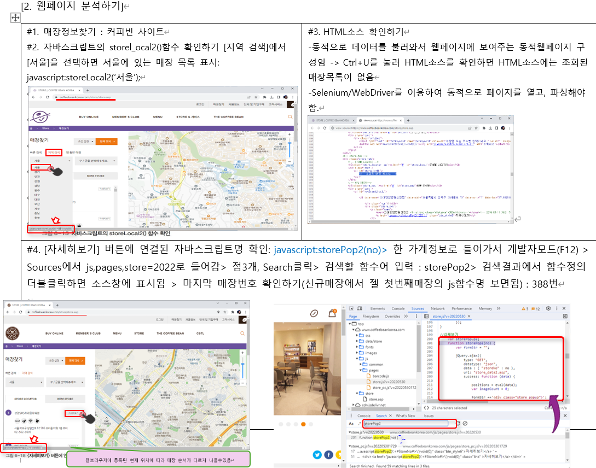

# 동적 웹페이지 Crawling - CoffeeBean

## 뭐하는 코드인가요? 한줄설명
동적 웹페이지인 CoffeeBean의 홈페이지에서 원하는 data crawling

## 작업설계
### selenium 라이브러리
```
#셸에서 pip install selenium으로 Selenium 라이브러리 설치
from selenium import webdriver  #셀레니움 라이브러리의 Webdriver를 임포트
wd=webdriver.Chrome()  #크롬 WebDriver 객체생성 -> 크롬이 자동화된 테스트sw에 의해 제어되고 있다는 창뜸
wd.get("http://www.hanbit.co.kr")  #selenium이 제어하는 크롬창에서 웹페이지를 열어 확인
```

### 2. 웹페이지 분석하기
- 분석목표 : 동적활동에 연결된 js함수 확인

- 과정 : [자세히보기] 버튼에 연결된 자바스크립트명 확인: javascript:storePop2(no)> 한 가게정보로 들어가서 개발자모드(F12) > Sources에서 js,pages,store=2022로 들어감> 점3개, Search클릭> 검색할 함수어 입력 : storePop2> 검색결과에서 함수정의 더블클릭하면 소스창에 표시됨 > 마지막 매장번호 확인하기(신규매장에서 젤 첫번째매장의 js함수명 보면됨) : 388번

### 숨겨진 과정
개발자모드로 홈페이지 들어가서 html소스의 elements 구조를 확인  


### 결과 확인
