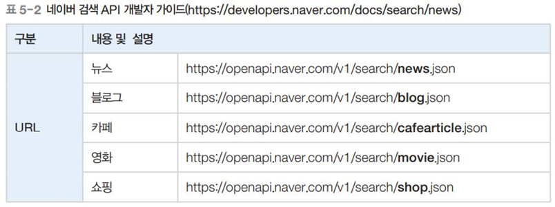
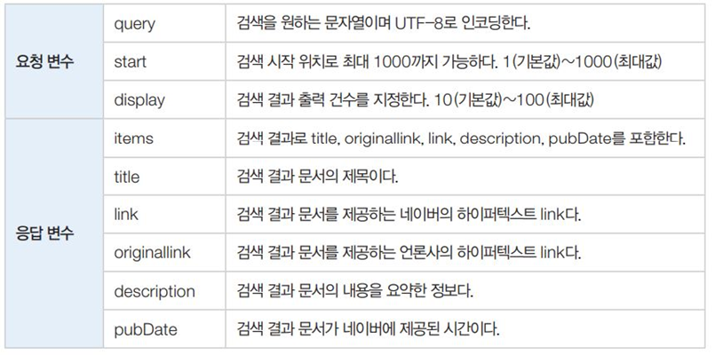

# Naver API를 이용한 blog Crawling

## 뭐하는 코드인가요? 한줄설명
- 검색어인 '월드컵'과 관련된 naver blog에 대한 정보가 json파일로 저장되어 나옴

## 개념 정리
### 크롤링
- 웹에서 데이터를 수집하는 작업
- 크롤러 또는 스파이더라는 프로그램으로 웹 사이트에서 데이터를 추출

### 웹 API
- 웹 API는 일반적으로 HTTP 통신을 사용하는데 사용
- 지도, 검색, 주가, 환율 등 다양한 정보를 가지고 있는 웹 사이트의 기능을 외부에서 쉽게 사용할 수 있도록 사용 절차와 규약을 정의한 것

## 사전작업
*네이버 개발자에 가입해서 클라이언트 ID와 Secret을 알아야 함.

### 네이버 개발자 가입
1. 네이버 개발자 센터 접속 : https://developers.naver.com
2. 오픈 API 이용 신청하기 
3. 애플리케이션 등록하기 
4. 애플리케이션 정보 확인하기 : ID와 secret
5. 검색 PAI 이용 안내 페이지 확인하기 : product > 서비스api > 검색 > 개발자가이드 보기
6. 검색 API 이용 안내 페이지 확인 

### 네이버 API 개발자 가이드

