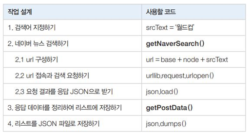
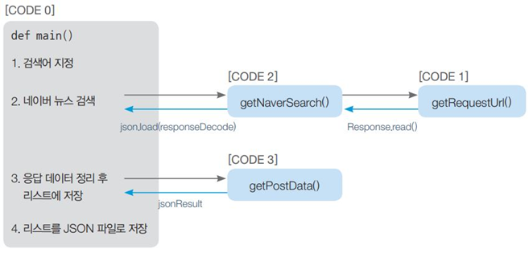
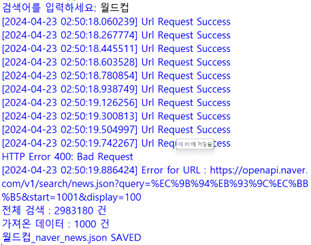

# Naver API를 이용한 News Crawling

## 뭐하는 코드인가요? 한줄설명
- 사용자로부터 입력받은 검색어가 들어간 100개의 naver news 정보가  json파일로 저장되어 나옴

## 전체작업 설계

## [CODE 0] 설명
### [CODE 0] 변수
- node: 네이버 검색 API에서 검색할 대상 노드
- srcText: 사용자 입력으로 받은 검색어 저장
- cnt: 검색 결과 카운트
- jsonResult: 검색 결과를 정리하여 저장할 리스트 객체
- jsonResponse: 네이버 뉴스 검색에 대한 응답을 저장하는 객체
- total: 전체 검색 결과 개수
- post: 응답받은 검색 결과 중에서 한 개를 저장한 객체
- items: 전체 응답 검색 결과로 내부 항목은 title, originallink, link, description,pubDate
- jsonFile: JSON 파일에 저장할 데이터를 담은 객체

### [CODE 0] 메서드
- input('검색어를 입력하세요: '): 사용자로부터 입력을 받는다.
- getNaverSearch(node, srcText, 1, 100): 1부터 100개의 검색 결과를 처리한다.
- getPostData(): 검색 결과 한 개를 처리한다
- json.dumps(): 객체를 JSON 형식으로 변환
- while, for문
    - 검색 결과jsonResponse에 데이터가 있는 동안 for문(11~13행) 으로 검색 결과를 한 개씩 처리하는 작업getPostData( )을 반복
    - 반복 작업이 끝나면 다음 검색 결과 100개를 가져오기 위해 start 위치를 변경

## [CODE 1] 설명
url 접속을 요청하고 응답을 받아서 반환하는 부분을 작성

### [CODE 1] 변수
- 매개변수 url : 네이버 뉴스 검색(“월드컵”)에 대한 url
- 지역변수 req: url 접속 요청(request) 객체
- app_id: 네이버 개발자로 등록하고 받은 Client ID
- app_secret: 네이버 개발자로 등록하고 받은 Client Secret
- response: 네이버 서버에서 받은 응답을 저장하는 객체

### [CODE 1] 메서드
- urllib.request.Request(): urllib패키지의 request모듈에 있는 Request() 함수로 네이버 서버에 보낼 요청(request) 객체를 생성
- Request.add_header(): 서버에 보내는 요청 객체에 헤더 정보를 추가
- urllib.request.urlopen(): 서버에서 받은 응답을 변수에 저장하기 위해 메모리로 가져오는 urllib의 request 모듈에 있는 함수
- response.getcode(): 요청 처리에 대한 응답 상태를 확인하는 response 객체의 멤버 함수로 상태 코드가 200이면 요청 처리 성공을 나타냄
- datetime.datetime.now(): 현재 시간을 구하는 함수
- response.read().decode('utf-8'): utf-8 형식으로 문자열을 디코딩

## [CODE 2] 설명
### [CODE 2] 변수
- node: 네이버 검색 API를 이용하여 검색할 대상 노드(news, blog, cafearticle, movie, shop 등)  
- srcText: 검색어
- page_start: 검색 시작 위치(1~1000) 
- display: 출력 건수(10~100) 
- base: 검색 url의 기본 주소 
- node: 검색 대상에 따른 json 파일 이름
- parameter: url에 추가할 검색어와 검색 시작 위치, 출력 건수 등의 매개변수 
- responseDecode: getRequestUrl(url)을 호출하여 반환받은 응답 객체(utf-8로 디코드)

### [CODE 2] 메서드
- getRequestUrl(url): [CODE1]을 호출하여 url 요청에 대한 응답을 받음
- json.loads(responseDecode): 응답 객체를 파이썬이 처리할 수 있는 JSON 형식으로 변환

## [CODE 3] 설명
JSON 형식의 응답 데이터를 필요한 항목만 정리하여 딕셔너리 리스트인 jsonResult를 구성하고 반환하도록 작성

### [CODE 3] 변수
- post: 응답으로 받은 검색 결과 데이터 중에서 결과 한 개를 저장한 객체
- jsonResult: 필요한 부분만 저장하여 반환할 리스트 객체
- cnt: 현재 작업 중인 검색 결과의 번호
- post['title']: post 객체의 title 항목에 저장된 값
- post['description']: post 객체의 description 항목에 저장된 값
- post['originallink']: post 객체의 originallink 항목에 저장된 값
- post['link']: post 객체의 link 항목에 저장된 값

### [CODE 3] 메서드
- datetime.datetime.strptime(): 문자열을 날짜객체형식으로 변환
- pDate.strftime(): 날짜 객체의 표시 형식을 지정
- jsonResult.append(): 리스트 객체인 jsonResul에 원소를 추가

## 작동결과

- 코드를 파이썬에 복붙 후 실행 > "검색어를 입력하세요 :" 월드컵 입력 > 바탕화면에 JSON파일 생성됨 > JSON파일 확인
- *에러이유 : 원래는 13만4천건 가져올 수 있는데 네이버측에서 1000개만 가져오도록 설정해놔서 STOP되고 오류메시지 뜸 

## [CODE 1] 설명
### [CODE 1] 변수
### [CODE 1] 메서드