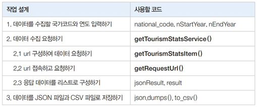
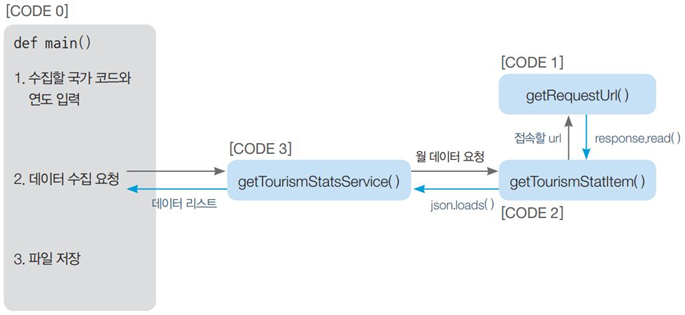

# Public API를 이용한 tour정보 Crawling

## 뭐하는 코드인가요? 한줄설명

## 공공데이터 API 준비
- 공공데이터포털 회원가입 > ‘출입국관광통계서비스’검색 > 오픈API 개발계정 신청, 발급받기 > 오픈API 사용방법 확인
- *요청변수 : 서비스 URL 뒤에 추가할 매개변수 항목
- *출력결과 : 크롤링 결과로 받을 데이터 항목
- *샘플코드 : 서비스 URL과 매개변수를 연결해서 만든 url에 HTTP 요청을 보내고 응답을 받는 작업을 프로그래밍 언어로 구현한 코드를 보임

## 전체작업 설계

## [CODE 0] 설명
### [CODE 0] 변수
- jsonResult: 수집한 데이터를 저장할 리스트 객체로 JSON파일 저장용
- result: 수집한 데이터를 저장할 리스트 객체로 CSV 파일 저장용
- nat_cd: 데이터를 수집할 국가 코드
- natName: 데이터를 수집할 국가 이름
- ed_cd: 입국/출국 코드('E' 또는 'D')
- nStartYear: 데이터 수집 시작 연도
- nEndYear: 데이터 수집 끝 연도
- dataEND: 마지막 데이터의 연월
- jsonFile: JSON 파일에 저장할 데이터를 담은 객체

### [CODE 0] 메서드
- input(): 사용자로부터 입력을 받는다.
- getTourismStatsList(): 방한외래관광객 데이터를 요청 ([CODE 3])
- json.dumps(): 객체를 JSON 형식으로 변환
- pd.DataFrame(): 리스트를 데이터프레임 형식으로 변환
- to_csv(): 데이터프레임을 CSV 파일로 저장

## [CODE 1] 설명
url 접속을 요청하고 응답을 받아서 반환
### [CODE 1] 변수
- url : 출입국관광통계서비스의 오픈 API를 사용하는 데이터를 요청하는 url
- req: url 접속을 요청하는 객체
- response: 서버에서 받은 응답을 저장하는 객체
### [CODE 1] 메서드
- urllib.request.Request(): urllib 패키지의 request 모듈에 있는 Request() 함수로 요청 객체를 생성
- urllib.request.urlopen(): 서버에 요청을 보내고 받은 응답을 객체로 반환 
- response.getcode(): 요청 처리에 대한 응답 상태를 확인하는 response 객체의 멤버 함수, 상태 코드가 200이면 요청 처리 성공을 나타냄
- datetime.datetime.now(): 현재 시간을 구함 
- response.read().decode('utf-8'): 문자열을 utf-8 형식으로 디코딩

## [CODE 2] 설명
출입국관광통계서비스의 오픈 API를 사용하여 데이터 요청 url을 만들고 [CODE 1]의 getRequestUrl(url)을 호출해서 받은 응답 데이터를 반환
### [CODE 2] 변수
- yyyymm: 수집할 연월(예: 202003)
- nat_cd: 수집 대상 국가의 코드(예: 중국 = 112)
- ed_cd: 수집할 데이터 종류(방한외래관광객 = "E")
- service_url: 출입국관광통계서비스의 공공데이터에 접속할 앤드포인트 주소
- parameters: url에 추가할 매개변수
- url: service_url과 parameters를 연결하여 완성한 url
- responseDecode: [CODE1]의 getRequestUrl(url)을 호출하여 반환받은 응답 객체

### [CODE 2] 메서드
- getRequestUrl(): [CODE1]을 호출하여 url 요청에 대한 응답 데이터를 받음
- json.loads(): json 형식으로 받은 응답 데이터인 responseDecode를 파이썬 객체로 읽음

## [CODE 3] 설명
수집 기간 동안 월 단위로 [CODE 2]의 getTourismStatsItem()을 호출해 받은 데이터를 리스트로 묶어 반환
### [CODE 3] 변수
- nat_cd: 수집 대상 국가의 코드(예: 중국 = 112)
- ed_cd: 수집 데이터의 종류(방한외래관광객 = "E")
- nStartYear: 데이터 수집 시작 연도
- nEndYear: 데이터 수집 끝 연도
- jsonResult: 수집한 데이터를 JSON 저장용으로 구성할 딕셔너리의 리스트 객체
- result: 수집한 데이터를 CSV 저장용으로 구성할 리스트 객체
- jsonData: [CODE2]의 getTourismStatsItem()을 호출하여 반환받은 응답 객체
- dataEND: 마지막 데이터의 연월
- isDataEnd: 데이터의 끝 확인용 플래그
- natName: 수집한 국가 이름 데이터
- num: 수집한 방문객 수 데이터
- ed: 수집한 출입국 구분 데이터

### [CODE 3] 메서드
- getTourismStatsItem(): [CODE2]를 호출하여 응답으로 받은 월 데이터를 반환
- json.dumps(): 객체를 JSON 형식으로 변환

## 실행결과
국가코드 112, 데이터수집 시작연도는 2017, 데이터수집 마지막연도는 2021입력 > 실행됨 > 실행 끝나면 파일이 저장된 위치에 JSON파일과 CSV파일이 생성됨. > 결과확인
