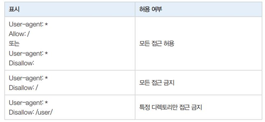

# 정적 웹페이지 Crawling - HollysCoffee

## 뭐하는 코드인가요? 한줄설명
정적 웹페이지인 HollysCoffee의 홈페이지에서 원하는 data crawling

## 전체작업 설계
### 웹페이지 크롤링 하기 전 확인!!!!
- 웹페이지를 크롤링하기 전에 크롤링 허용여부를 확인하기 위해 주소창에 ‘크롤링할 주소/robots.txt’를 입력
- 만약 robotx.txt 파일이 없다면 수집에 대한 정책이 따로 없다는 의미.

- 사진처럼 Allow:/ 이거나 Disallow : 일때만 이 웹페이지 크롤링이 가능하다.

### 웹페이지 분석하기.
- 할리스커피 매장정보 크롤링 결정 -> 할리스커피 사이트가기 > 매장검색 페이지 > (Ctrl + U로 HTML코드 확인하기) > 2페이지로 가니까 주소창이 pageNo=2로 바뀌는 것을 확인함. 페이지가 총 51개 있으니까 for문으로 51개 까지 돌리면됨

## 크롤링된 내용을 확인
```
len(result) 
#40  #결과가 저장된 result의 원소개수 확인
result[0]  
#['부천심곡점', '경기 부천시 소사구', '경기도 부천시 장말로 376 심곡동 355-1', '032-612-7258'] 첫번째원소확인
result[39] 
#['대구반야월점', '대구 동구', '안심로255', '053-961-7007']  #마지막원소확인
store_td    
#[<td class="noline center_t">대구 동구</td>, <td class="center_t"><a href="#" onclick="javascript:storeView(1039); return false;">대구반야월점</a></td>, <td class="center_t tdp0">영업중</td>, <td class="center_t"><a href="#" onclick="javascript:storeView(1039); return false;">안심로255</a></td>, <td class="center_t">


</td>, <td class="center_t">053-961-7007</td>]  
#마지막 매장정보가 저장되어 있는 store_td의 내용확인

store_td[1].string   #'대구반야월점'
store_td[0].string   #'대구 동구'
store_td[3].string   #'안심로255'
store_td[5].string   #'053-961-7007'
```